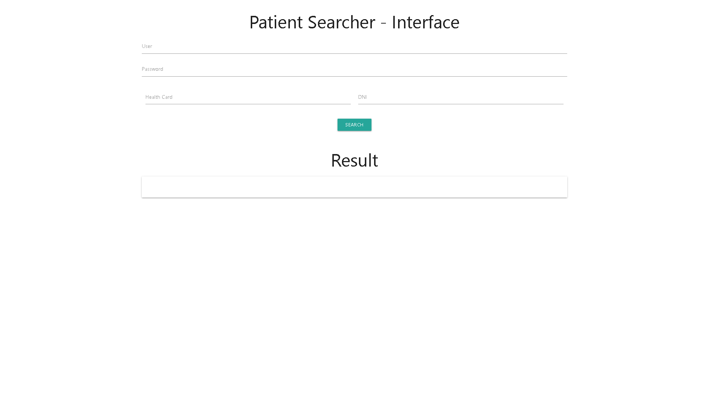

# Patient Searcher Interface
A simple interface to find a patient by health information, health card or dni with login.
The server provides a token to access. That token will be used in the header of the next get request to remote server.
# Presentation:
-----------------------------------
